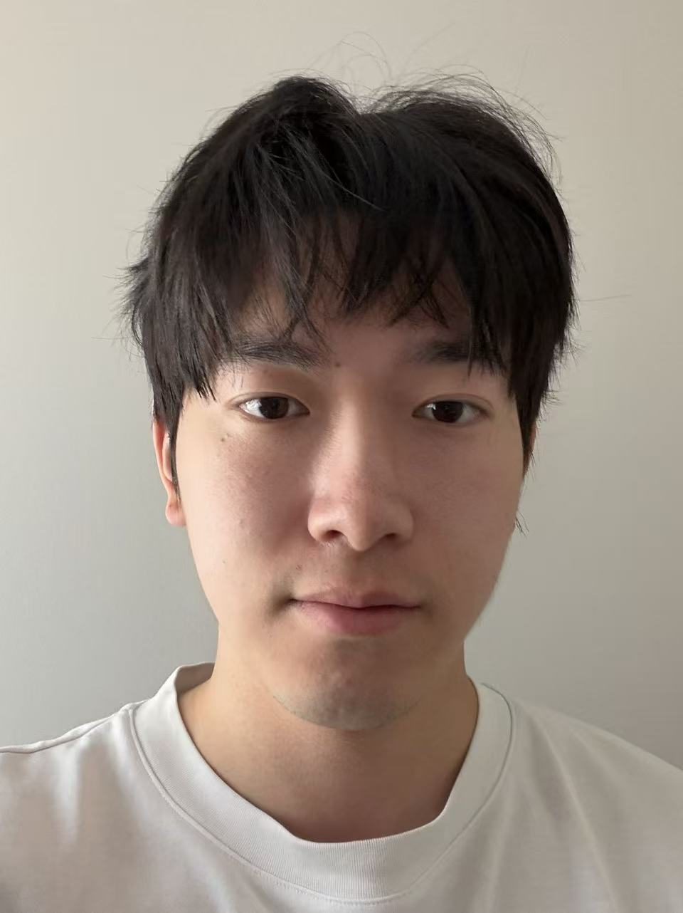

{width=250px}

Hi! My name is YuanChen (Cary) Ling, and I am originally from China. Before joining the MDS program, I completed my undergraduate degree at the University of Toronto, where I majored in Mathematics and Statistics. My career goal is to become a professional data analyst, and I hope to pursue this path after graduating from the MDS program. Outside of data science, I am also passionate about DJing and breaking—maybe they could even become part-time careers someday, who knows?
